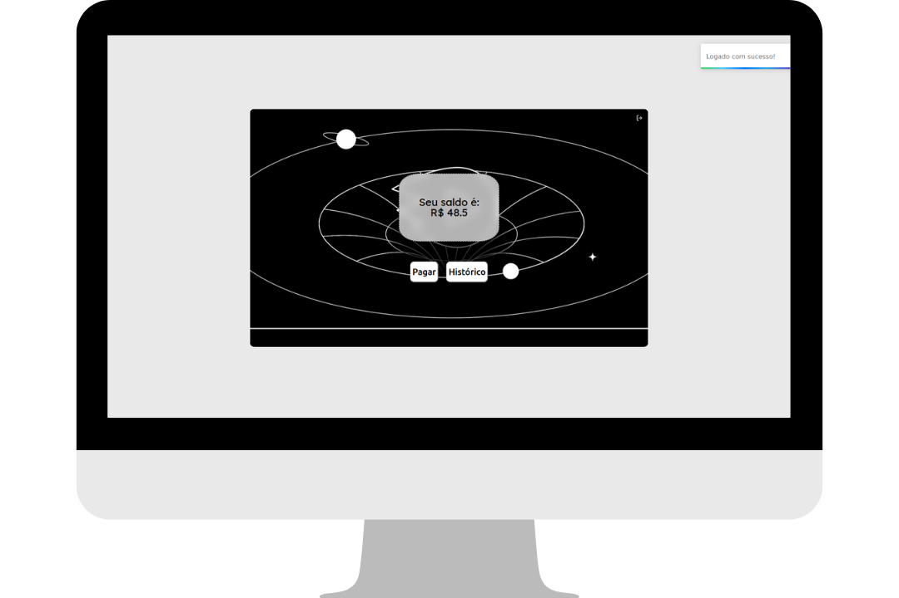

## Tecnologias 

Here are the technologies used in this project.
```
  Front-End
```
* Vite
* React
* Typescript
* Styled-components

## Começando
* Primeiro: iniciar o back-end
* Depois execute os comandos:  
<code>npm i</code><br>
<code>npm run dev</code>
* Seu sistema irá iniciar em <a href="http://localhost:5173 ">***http://localhost:5173*** </a>

## Como usar?
### 1 - Assim que abrir a págia na qual você poderá criar um login


### 2 - Você será capaz de ver seu saldo atual se estiver logado.



### 3 - Essa é a na qual você insere um valor para uma transação


### 4 - Ao clicar em prosseguir, poderá escolher um usuário buscando ele pelo nome.


### 5 - Nesta página, você verá o resumo da sua tranferência


### 6 - Aqui, você verá o historico das suas transações


## Features

  ## Versioning

  1.0.0.0


  ## Authors

  * **Marcus Vinicius de Souza Soares** 


